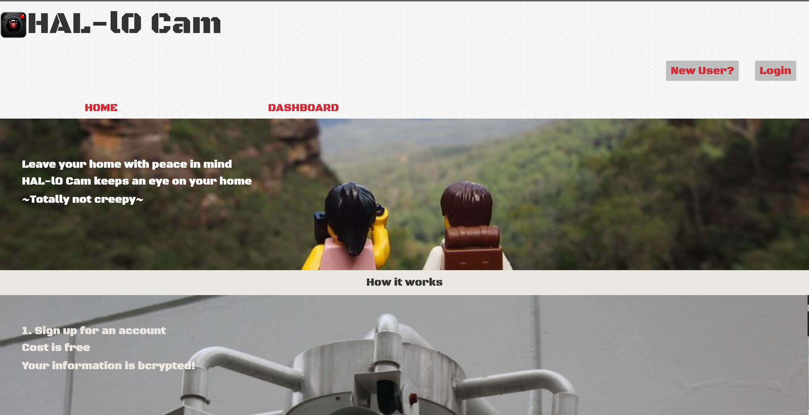
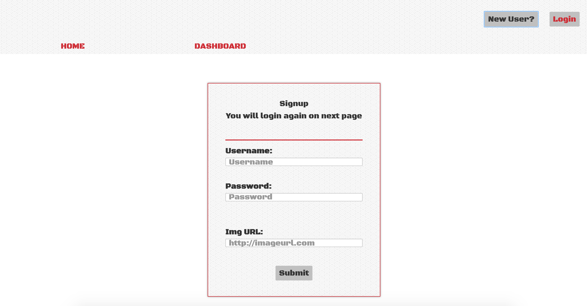
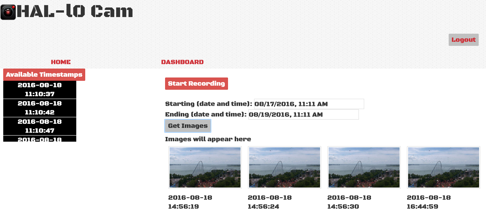
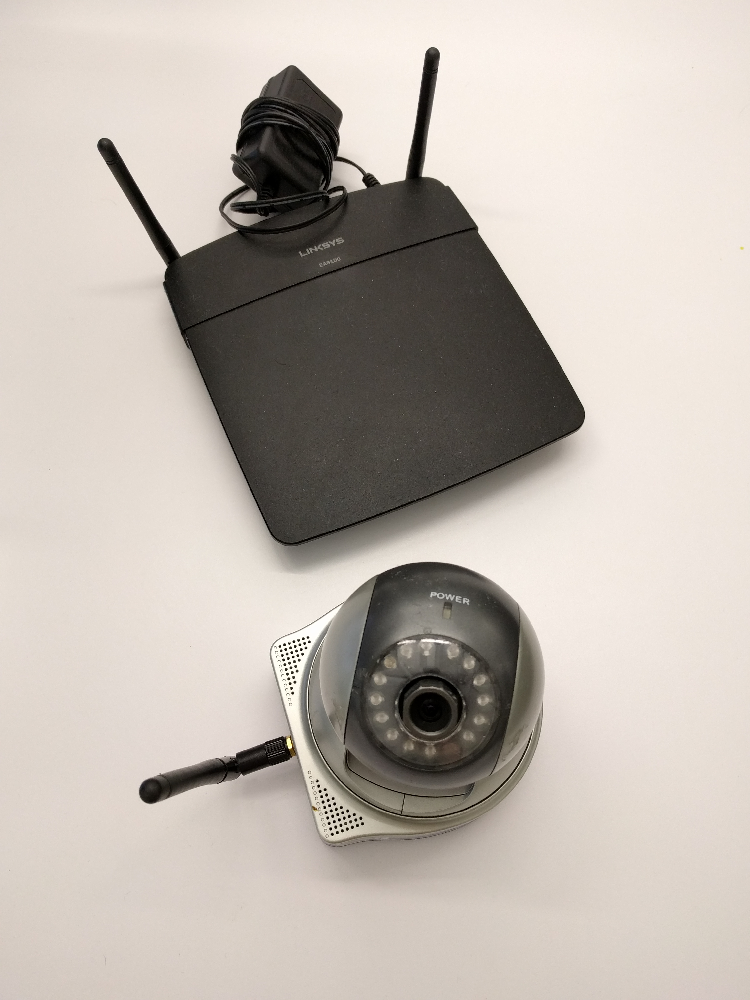
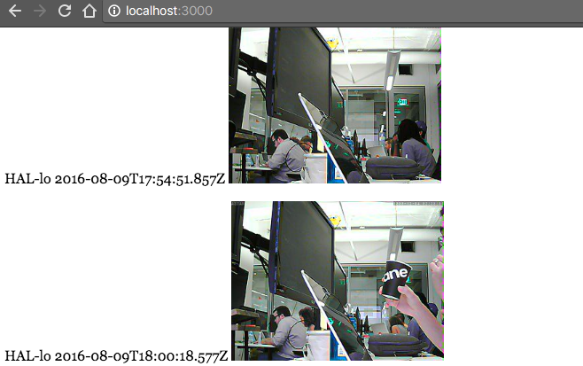
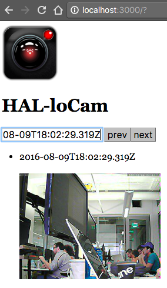

# HAL-l0Cam
##Overview of Project
HAL-l0 Cam is minimalistic portal to store your still image feeds from cameras. Keep track of your pets or keep an eye on what's going on at your home. Originally named, Hello-cam, I thought it would be a fun pun on HAL from 2001 Space Odyssey —also, I get to have a mascot that strikes fear into bad guys. ~totally not creepy~

##Technologies, Frameworks, and Programming Languages used
* HTML, CSS, Javascript - main entrance to the project
* AngularJS - frontend logic to push/pull data to backend
* Node.js - to handle backend, plus use middleware — functions that have access to the request object (req), the response object (res), and the next middleware function in the application’s request-response cycle
* MongoDB - to store the images to external database; thanks to mlab.com!

##Project Screenshots




##3 future contributions I'd like the community to add
* A table/directory of supported cameras that have still image feeds
* GridFS integration to handle videos (using this also allows for auto-deletion of old videos to accomodate memory savings)
* Motion-detection integration for cameras

##Check it out here


#Obstacles:
There were a lot of moving parts to this project. I figure the best approach is to take it one milestone at a time.

###Table of Contents
* [1. Finding resources to work with](https://github.com/phamous2day/HAL-l0Cam#1-finding-resources-to-work-with)
* [2. Uploading files to MongoDB](#2-uploading-files-to-mongodb)
* [3a. Using AngularJS filter to display images based on timestamp](#3a-using-angularjs-filter-to-display-images-based-on-timestamp)
* [3b. Filter images by timestamp: passing front end data to backend](#3b-filter-images-by-timestamp-passing-front-end-data-to-backend)
* [3c. Using a "datepicker" to make time ranges more elegant](#3c-using-a-datepicker-to-make-time-ranges-more-elegant)
* [4. Make a Record/Stop video: ng-switch and clearing the interval on the backend](https://github.com/phamous2day/HAL-l0Cam/blob/master/README.md#4-make-a-recordstop-video-ng-switch-and-clearing-the-interval-on-the-backend)
* [5. Request parameters and binding content exclusively to users](https://github.com/phamous2day/HAL-l0Cam/blob/master/README.md#5-request-parameters-and-binding-content-exclusively-to-users)


###1. Finding resources to work with

First issue was not having the right equipment (some IP cameras don't give me the necessaary information I need, e.g. FOSCam cameras didn't provide IP address or other ways to extract information. They were limited by their app). Eventually, I did find a website that has a "still image feed" here:
https://www.cedarpoint.com/online-fun/live-video-cam

To capture the images say every 8 seconds, I used setInterval which looks like this:
```javascript
var i = 0;
setInterval(function() {
  request('http://192.168.x.xxx/xxxx/camera.jpg').pipe(fs.createWriteStream('DCCam'+i+'.png'));
  i++;
}, 8000);
```

###2. Uploading files to MongoDB
On my research, I learned about [GridFS](http://excellencenodejsblog.com/gridfs-using-mongoose-nodejs/). To summarize as files are uploaded they are split into 2 chunks: one to store metadata the other to store the files as a "chunk." With the limitation of how much memory I have in the database, I realize to do a videostream would take up too much memory. So, I opted for still images instead, leading me to ditch GridFS.




When images are stored to something like MongoDB, they aren't stored as actual images. Instead, they're stored as either binary or "buffers." To convert the buffers to images on the front end, it'll invole 'base64':

**Backend**
```javascript
app.get('/images', function(request, response, next) {
  Image.find()
  .then(function(images) {
    images = images.map(function(image) {
      return {
        timestamp: image.timestamp,
        data: image.data.toString('base64')
      };
    });
    response.json(images);
  })
  .catch(next);
});
```

IMPORTANT: when working with base64 conversion, you'll encounter errors in the browser console that mentions how "unsafe" the urls are. To sanitize the image links, it'll look like this:
>imgSrcSanitizationWhitelist([regexp]); 

*from https://docs.angularjs.org/api/ng/provider/$compileProvider

With the way my code was written, I had to chop some things out to make it less specific. I made the parameter below match up to exclusively the image instead of factoring other possible parameters like links.
**Frontend: AngularJS**
```javascript
app.config(function($compileProvider){
  $compileProvider.imgSrcSanitizationWhitelist(/^data:image/);
});
```

>"Retrieves or overrides the default regular expression that is used for whitelisting of safe urls during img[src] sanitization.
>The sanitization is a security measure aimed at prevent XSS attacks via html links.

>Any url about to be assigned to img[src] via data-binding is first normalized and turned into an absolute url. Afterwards, the url is matched against the imgSrcSanitizationWhitelist regular expression. If a match is found, the original url is written into the dom. Otherwise, the absolute url is prefixed with 'unsafe:' string and only then is it written into the DOM.

For more information on [Base-64 encoding images in Node.js visit](http://nodeexamples.com/2012/09/26/base-64-encoding-images-in-node-js/)


###3a. Using AngularJS filter to display images based on timestamp
Not having much practice with Date filters (especially since I don't want it to pull everything that comes with it, but rather, a shortened "timestamp" filter which I would have to make), I found a sampling of [how it looks here](http://plnkr.co/edit/vxIewUDGDjiz80W1Itag?p=preview):

Here's what they have:
```javascript
function MainController($scope) {

  $scope.year = 2015;
  $scope.combinations = [
    { name : 'a', date: new Date(2015, 3, 1) },
    { name : 'b', date: new Date(2015, 3, 1) },
    { name : 'c', date: new Date(2014, 3, 1) },
    ];

  $scope.ofYear = function(year) {
      return function(c) {
        return c.date.getFullYear() === year;
      }
  }
  
  $scope.next = function() {
    $scope.year++;  
  }
  
  $scope.prev = function() {
    $scope.year--;  
  }
}
```
In the above example, they inserted a hard-coded year to be 2015, their "combinations" is set to a static array of values,

**Here's what I changed it to:**
```javascript
function MainController($scope, $http) {
  $http.get('/images')
  .success(function(data,status){
    $scope.Images = data;

    $scope.ofTimestamp = function(image) {
        return image.timestamp >= $scope.timestamp;
    };
    $scope.next = function() {
      $scope.timestamp++;
    };
    $scope.prev = function() {
      $scope.timestamp--;
    };
  });
}
```
I'm going to the timestamp based on user input. I'm not using a static array of predefined values to be looped through, since I already hav that made with the $scope.Images which stores a buffer of images I stored in my database.

Note to self: What mongodb query looks like to get between dates -
```js
db.getCollection('images').find({
       "timestamp": {
        $gte: ISODate("2016-08-09 18:02:04.359Z"),
        $lt: ISODate("2016-08-09 18:02:24.311Z")
    }
})
```

###3b. Filter images by timestamp: passing front end data to backend.



Components include: build a form to take in start and end time, apply "ng-model" to both times to get the values independently, then $scope the values to the frontend js, then pass those values to the backend server.js

```html
<body ng-app="app" ng-controller="MainController">
  <form>
    Start: <input ng-model="starttime" type="text"  placeholder="Starting point"><br>
    End: <input ng-model="endtime" type="text" placeholder="ending point"><br>
    <button ng-click="getImages()">Get Images</button>
    <ul>
      <li ng-repeat="image in Images"> test{{image.timestamp}} <br></br>
        </li>
      </ul>
    </form>
```

Frontend JS
```js
$scope.getImages = function() {
    var parameterTimes =
    {
      "$gte": $scope.starttime,
      "$lte": $scope.endtime,
    };

    $http.post('/images', parameterTimes)
    .success(function(data,status){
      $scope.Images = data;
    })
    .error(function(status){
      console.log("status is: " + status);
    });
```
Backend to mongo
```js
app.post('/images', function(request, response, next) {

  Image.find({
    "timestamp": {
      // take timestamp from request.body
      $gte: request.body.$gte,
      $lte: request.body.$lte
    }})
    .then(function(images) {
```

###3c. Using a "datepicker" to make time ranges more elegant
I wanted to use a fancy date time picker to specify the range since it's nearly impossible for users to input an exact timestamp like this format (from the top of their head): 2016-08-09 18:02:24.311Z

After scouring the internet, seems like the general direction was to use "angular UI" ...but that's mostly for display and it's tough to $scope the input time from front end to backend. Then, I found this: [https://codepen.io/Sinetheta/pen/Ftjwi](https://codepen.io/Sinetheta/pen/Ftjwi) which looks really and had everything I needed ... but turns out it used jQuery, and I didn't want to get my code messier with assorted languages.

In the end, I found a "datetime" drop down from W3 school, which looks like this:

```html

<form action="action_page.php">
  Birthday (date and time):
  <input type="datetime" name="bdaytime">
  <input type="submit">
</form>
```

The issue here is that it uses that specific action_page.php, which I don't want to use. It's a simple fix, instead of telling it that action, I made the form do a: **form methods = "POST"** 

Final Date/Time Range code
```html
<body ng-app="app" ng-controller="MainController">
  <form methods= "POST">
    Starting (date and time):
    <input ng-model="starttime"type="datetime-local" name="startime">

    Ending (date and time):
    <input ng-model="endtime"type="datetime-local" name="endtime">

    <ul>
      <li ng-repeat="image in Images"> test{{image.timestamp}} <br></br>
        </li>
      </ul>

      <button ng-click="getImages()">Get Images</button>
    </form>
    </body>
```

I also wanted to refine the search to pull just the timestamps rather than a bunch of data. Looking [at MongoDB docs](https://docs.mongodb.com/v3.0/reference/method/db.collection.find/) I found this snippet — the following operation finds documents in the bios collection and returns only the name field and the contribs field:
:
```mongo
db.bios.find(
   { },
   { name: 1, contribs: 1, _id: 0 }
)
```
###4. Make a Record/Stop video: ng-switch and clearing the interval on the backend
Because I'm capturing images using a setInterval(), I learned that there's a way to [stop it using clearInterval():](http://stackoverflow.com/questions/109086/stop-setinterval-call-in-javascript)

The bettter but uglier way to stop it is to make "setInterval" to a global variable so that it can be passed to the clearInterval(globalvariablehere). It's ugly because global variables have a bad reputation for name collisons, but for the sake of this project, hakuna matata ;)

Backend function to stop recording looks like this — after I made global variable CaptureImages = setInterval():
```js
app.post('/stopRecord', function(request, response, next) {
clearInterval(CaptureImages);
});
```

Next up, I wanted to make a cool Start/Stop record button without making 2 separate buttons an learned how to accomplish this using [ng-switch like this](http://jsfiddle.net/uEbUD/):
```js
$scope.selected = true;
$scope.button1 = function () {
  //do logic for button 1
  $scope.selected = !$scope.selected;
  console.log('btn1 clicked');
  console.log("$scope capture");
  $http.post('/recordImages')
  .success(function(data, status){
  })
  .error(function(status){
    console.log("status is: " + status);
  });
};

$scope.button2 = function () {
  //do logic for button 2
  $scope.selected = !$scope.selected;
  console.log('btn2 clicked');
  $http.post('/stopRecord');
  console.log("Recording has stopped");
};
```

###5. Request parameters and binding content exclusively to users
With this project, I had a lot of sandboxed environments separating each functionality to make sure it work independently before merging. When it came to consolidating all the code, I was tempted to leave the js files separate and just reference them in the index.html them ... but that gets pretty messy as I illustrate a scenario:

Let's think of the following use case: When users sign up to my website, their credentials get stored in a model (username, password, a token for a session, etc.). When users actually record images, that information gets stored in a separate model. Why note make everything stored in one model for thes sake of efficiency? Well, that's when things can get messy:

I have a mongoose model that holds user information like this:
```js
var User = mongoose.model('User', {
  _id: { type: String, required: true },
  password: { type: String, required: true },
  imgURL: { type: String, required: true },
  authenticationTokens: [{ token: String, expiration: Date }],
});
```

Then I have a separate module for images like this:
```js
var Image = mongoose.model('Image', {
  user: String,
  data: Buffer,
  timestamp: { type: Date, default: Date.now }
});
```

Had I combined it, it would make no sense because when users sign up, they don't have picture information. Plus, there are other limitations or craziness to think about. The amount of users would dwarf the amount of pictures. So, how would would I go about binding pictures exlusively to users? By authenticating a token which then uses routes to pass certain data (like username) to the image model.

Here's a sample **frontend js** that passes Timestamps exclusive to a user:
```js
app.controller('ImagesController', function ImagesController($scope, $http, $cookies) {
  //the below to pull availableTimeStamps
  $http.get(API+'/getTimestamps/'+$cookies.get('token')).then(function(timestamp)
  {
    // console.log("availableTimestamps data is ", timestamp);
    $scope.availableTimestamps= timestamp;
  },function(err)
  {
    console.log("ImagesController error is", err);
  }
);
```

Here's the corresponding **backend js** that authenticates token, extracts the username, then pulls timestamp based on that:
```js
app.get('/getTimestamps/:token',authRequired, function(request, response, next) {
    var user = request.user;
    var images = request.params.images;
    Image.find(
      {user: user},
      { timestamp: 1}
    )
    .then(function(images) {
      justTimestamps = images.map(function(image) {
        return {
          timestamp: image.timestamp,
        };
      });

      response.json(justTimestamps);
    })
    .catch(function(error){
      console.log(error);
      next();
    });
  });
  ```

#Closing thoughts
It's an oversimplication to say this, but I learned a lot from this project and from DigitalCrafts overall. Having a project like this with so many moving pieces reaffirms the material I've learned these past months. Whether if it's reviewing basic AngularJS binding or directives to doing fancier routes with Node.js (passing tokens in $http.get API calls), this was a great final project to end my coding-bootcamp journey.

Special thanks to my trainer, Toby,[@airportyh](https://github.com/airportyh) who kept the "you can do it, nothing is too difficult" spirit with me all the way. Especially since this final project dealt with material that went beyond the curriculum: hardware, networks, videography image buffers. I'm very grateful to have such well-rounded expertise throughout my development. Thank you and hope you enjoy my thoughts!

